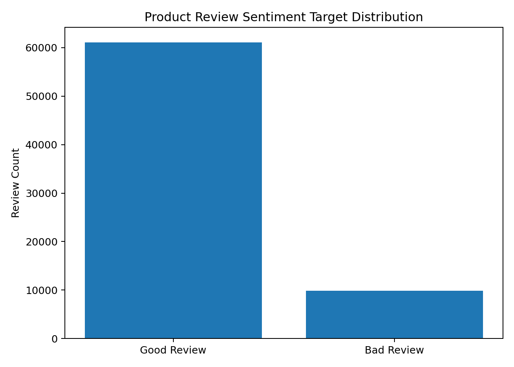
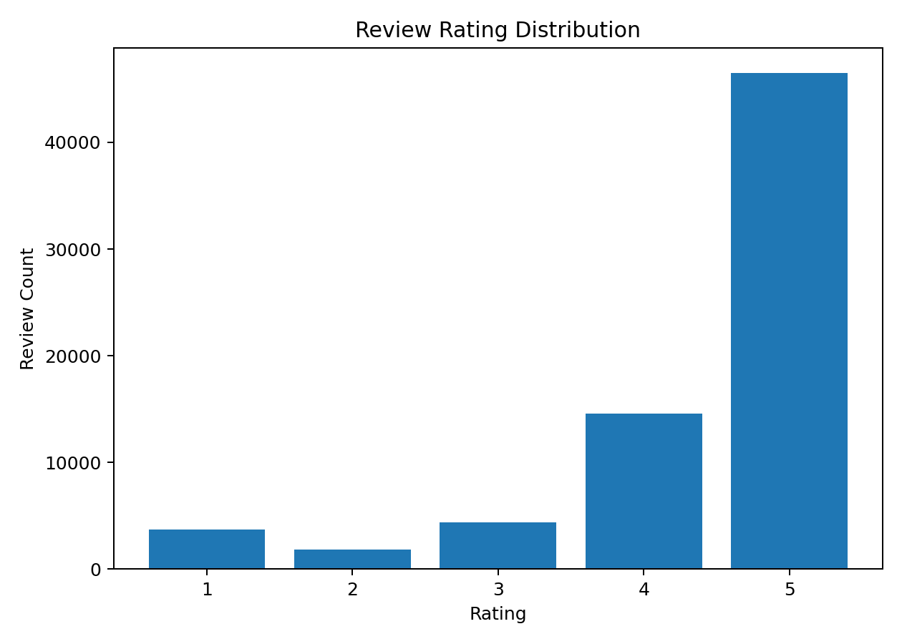
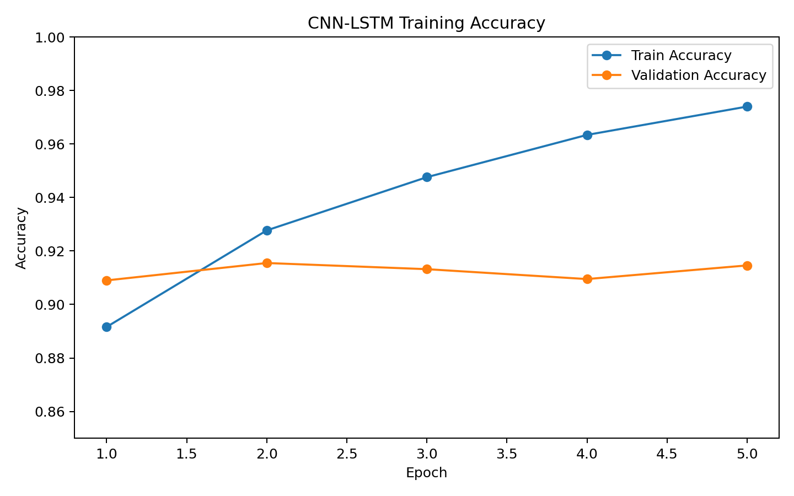
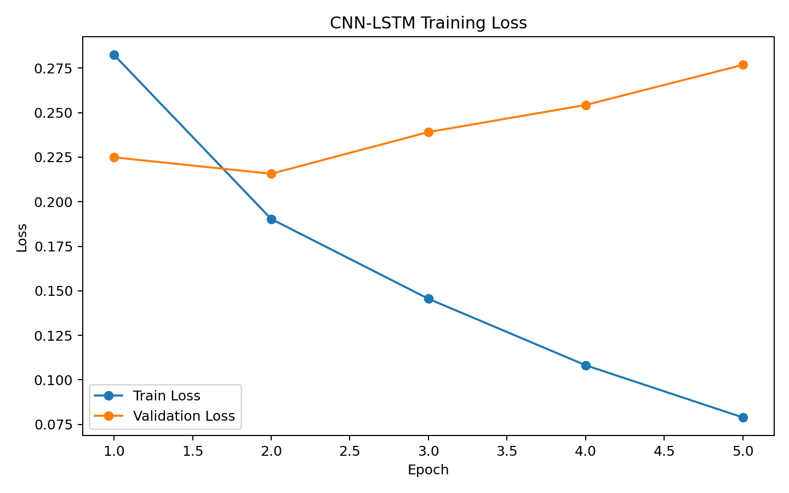
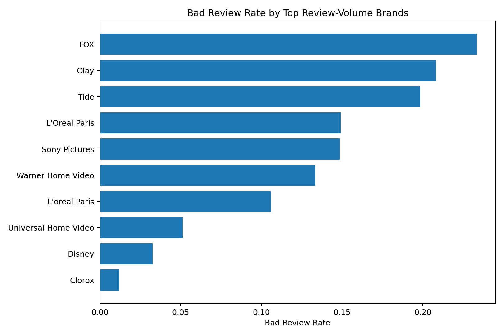

# Product Review CNN-LSTM Sentiment Classification

Deep-learning project that classifies customer product reviews as **good** or **bad** using a CNN-LSTM hybrid architecture.

## Overview

This repository turns product-review text into a binary sentiment-classification workflow. The target is created from review ratings:

- **Bad review:** rating below 4
- **Good review:** rating 4 or 5

The model uses Keras tokenization, padded integer sequences, convolutional feature extraction, LSTM sequence modeling, and a softmax output layer.

## Dataset Summary

| Metric | Value |
| --- | ---: |
| Source rows | 71,044 |
| Modeling rows after text/rating cleanup | 71,008 |
| Columns | 25 |
| Good reviews | 61,108 |
| Bad reviews | 9,900 |
| Bad review rate | 13.94% |
| Unique brands | 391 |
| Unique products | 598 |
| Train rows | 56,806 |
| Test rows | 14,202 |

The 94.77 MB full raw CSV is intentionally excluded from normal Git history. See [DATA_ACCESS.md](DATA_ACCESS.md) for the expected local path and reproduction guidance.

## Model Performance

| Model | Test loss | Test accuracy |
| --- | ---: | ---: |
| CNN-LSTM hybrid | 0.2578 | **92.04%** |

Accuracy is the metric preserved in the original training output. Because the saved notebook did not preserve full test-set predictions, this repository does **not fabricate confusion-matrix or per-class metric values** from accuracy alone. Instead, reusable evaluation utilities generate the exact confusion matrix and precision/recall/F1 report when predictions are exported from a reproduced training run.

## Evaluation Pipeline

`src/evaluation.py` uses scikit-learn to calculate:

- confusion matrix
- per-class precision
- per-class recall
- per-class F1-score
- support
- accuracy and aggregate classification-report metrics

The evaluation pipeline saves:

```text
data/processed/confusion_matrix.csv
data/processed/classification_report.csv
figures/confusion_matrix.png
figures/per_class_metrics.png
```

After reproducing the model and saving a CSV with `true_label` and `predicted_label` columns, run:

```bash
python scripts/generate_evaluation_artifacts.py --predictions data/processed/predictions.csv
```

This design keeps reported metrics auditable and tied to actual model predictions.

## Modeling Workflow

```text
Raw Product Reviews
    |
    v
Clean Review Text + Ratings
    |
    v
Create Binary Sentiment Target
    |
    v
Keras Tokenizer with 20,000-word Vocabulary
    |
    v
Pad Reviews to 150 Tokens
    |
    v
Embedding -> Conv1D -> MaxPooling -> Dropout -> Conv1D -> MaxPooling -> Dropout -> LSTM
    |
    v
Softmax Classification: Good Review vs Bad Review
    |
    v
Confusion Matrix + Precision / Recall / F1 Evaluation
```

## Key Visuals

### Sentiment Target Distribution



### Rating Distribution



### Training Accuracy



### Training Loss



### Bad Review Rate by Top Review-Volume Brands



## Repository Structure

```text
product-review-cnn-lstm-sentiment/
├── .github/workflows/ci.yml
├── app.py
├── data/
│   ├── raw/
│   │   └── product_reviews_sample.xlsx
│   └── processed/
├── figures/
├── notebooks/
│   └── product_review_cnn_lstm_analysis.ipynb
├── scripts/
│   ├── generate_evaluation_artifacts.py
│   └── generate_processed_artifacts.py
├── src/
│   ├── __init__.py
│   ├── evaluation.py
│   ├── modeling.py
│   └── preprocessing.py
├── tests/
│   ├── test_evaluation.py
│   └── test_preprocessing.py
├── DATA_ACCESS.md
├── MODEL_CARD.md
├── PROJECT_REPORT.md
├── README.md
├── requirements.txt
└── LICENSE
```

The original instruction document is intentionally excluded, and the public repository avoids course-session or academic-project wording.

## Run Locally

```bash
python -m venv .venv
pip install -r requirements.txt
python -m pytest -q
streamlit run app.py
```

## Portfolio Relevance

This project demonstrates natural language processing, text preprocessing, sequence modeling, CNN-LSTM architecture design, deep-learning evaluation, confusion-matrix and classification-report tooling, dashboarding, reusable Python modules, data-governance decisions for large files, and CI-tested repository structure.

## Responsible Use

This is a portfolio NLP project. Product-review sentiment predictions should support trend analysis and prioritization, not replace human review for customer experience decisions.
